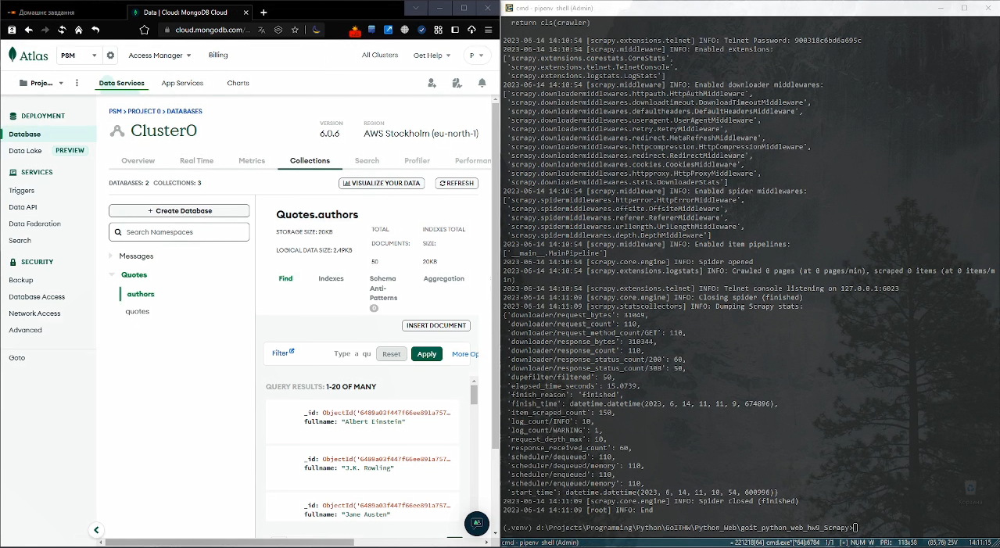

# Домашнє завдання #9 (друга частина)

Виконується скрапінг[^1] сайту http://quotes.toscrape.com за допомогою фреймворку [`Scrapy`](https://scrapy.org/). Дані скрапінгу зберігаються в базі даних `MongoDB` та в відповідних `json`-файлах

[^1]: Web-скрапінг (англ. web scraping) - це автоматизований процес видобування даних з web-сайтів.

## Демонстрація роботи проекту

[](https://youtu.be/7OeipiDob5s)

## Установка проекту

Для управління залежностями проекту використовується `pipenv`. Необхідно встановити `pipenv` перед виконанням наступних кроків:

- Склонируйте репозиторий:

  ```shell
  git clone https://github.com/sergiokapone/goit_python_web_hw9_Scrapy.git
  ```

- Для встановлення залежностей використайте команду `pipenv install` або `pipenv sync`.

## Запуск скрапінгу

Для виконання скрапінгу запустіть скрипт

```shell
python scrap.py
```

В результаті виконання скрипта дані записуються в базу даних `MongoDB` в колекцію `authors` та `quotes`. Також створюються (або перезаписуються) два файли

- `qoutes.json` містить що містить інформацію про цитати з усіх сторінок сайту;
- `authors.json` що містить інформацію про авторів зазначених цитат.
